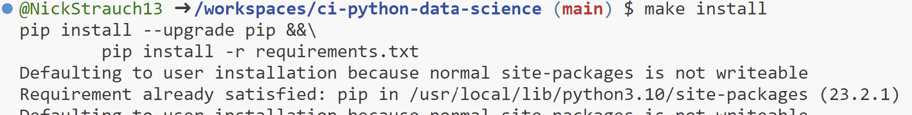
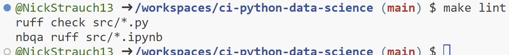
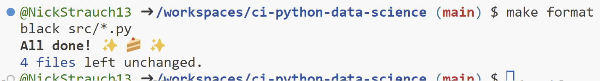
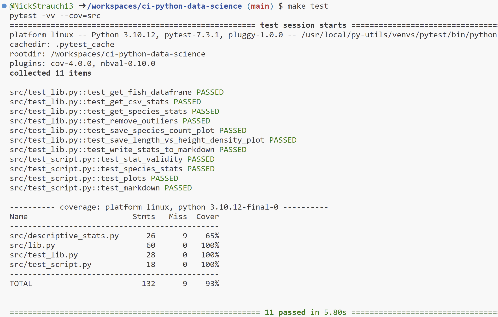
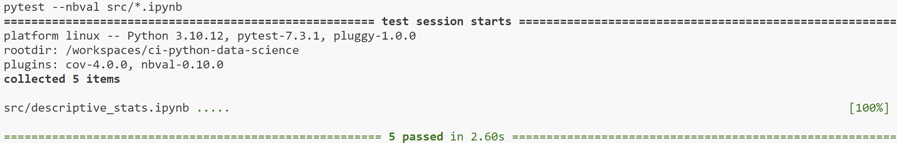

# Continuous Integration for Python Data Science

 
## About
- Inside the ``.devcontainer`` directory, you'll find a Dockerfile and devcontainer.json. The Dockerfile outlines how to construct the container, while other settings in this directory manage the development environment configuration.

- The ``.github/workflows`` directory houses GitHub Actions configurations, enabling the setup of automated pipelines for building, testing, and deploying your project.

- The ``.gitignore`` file is utilized to specify which files or directories should be excluded from version control when utilizing Git.

- A ``Makefile`` is present as a configuration file designed for automating tasks and facilitating software building in Unix-based systems. It contains instructions and dependencies for tasks like code compilation, test execution, and other development processes.

- The ``requirements.txt`` file is used to define the project's dependencies, including libraries and packages needed for its execution.

- The ``src/descriptive_stats.py`` script performs some data analysis using standard data science libraries.

- The ``src/descriptive_stats.ipynb`` notebook performs the same descriptive stats as in the script, but is present to ensure notebook testing functionality.

- The ``src/lib.py`` script contains functions used by the stats script and notebook.

- The ``src/test_script.py`` and ``src/test_lib.py`` test the stats and lib scripts respectively.

- The ``img`` directory is used to store any result images.

## GitHub Actions
The GitHub Actions CI (Continuous Integration) workflow runs the Makefile in this order: `make install`, `make lint`, `make format`, `make test`. This workflow helps to maintain code quality and consistency throughout the development process. 

Expected ``Makefile`` recipe results:

---

---

---

